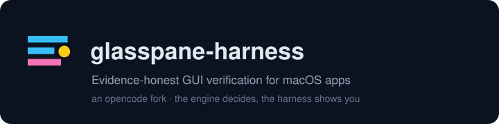

<h1 align="center">
  <code>glasspane-harness</code>
</h1>

<p align="center">
  <a href="README.md"><strong>English</strong></a> ·
  <a href="README.zh-CN.md"><strong>简体中文</strong></a>
</p>

<p align="center">
  <a href="https://www.npmjs.com/package/glasspane-harness"></a>
  
  <a href="https://github.com/jingzhao-l/glasspane-harness/actions/workflows/ci.yml"></a>
  <a href="LICENSE"></a>
  
  <a href="https://github.com/jingzhao-l/glasspane-harness"></a>
</p>

<p align="center">
  
</p>

---

**The problem.** An AI agent driving a real macOS app cannot honestly say whether the UI
did what it asked. It sees its own tool output, guesses from prose, and reports success.
Screenshots don't help: they show *a* moment, not a *change*, and they cannot say whether
the change was caused by the click.

**GlassPane Harness** is a coding agent (an [opencode](https://github.com/anomalyco/opencode)
fork) wired to a Swift verification engine through a native `gp_*` tool surface. Every
action is measured — accessibility-tree diff, pixel diff, crash and responsiveness
signals — and the engine reports **its own** attribution (`strong` / `soft` / `none`,
circuit-breaker level, pass / fail / inconclusive). The harness transcribes; it never
invents a verdict. Verified calls are appended to a hash-chained decision log, and a
compaction hook re-injects the session's evidence anchors so summarising can never quietly
drop the audit chain.

The engine is [GlassPane](https://github.com/jingzhao-l/GlassPane). The harness is the
agent side of it.

## Product surfaces

| Surface | What you get | How it ships |
|---|---|---|
| **CLI + TUI** | The agent in your terminal: interactive TUI, `run` for one-shot tasks, `serve` for headless clients | the `glasspane-harness` / `gp-harness` binaries, npm + one-click installer |
| **Web app** (embedded) | Browser UI served by the binary itself — no second process, no separate deploy | embedded in the binary (`--skip-embed-web-ui` for a CLI-only build) |
| **Docs** | This repository's `docs/` — install, tools, evidence, migration, troubleshooting | in-repo markdown (canonical; versioned with the code) |
| **SDKs** | TypeScript SDK and the plugin SDK for building your own `gp_*`-style tools | workspace packages, shipped with the tree |

Not shipped, on purpose: the upstream hosted console / enterprise stack (a private harness
has no use for an organisation-and-quota back office), the Electron desktop app (a second
batch — it needs signing and notarisation accounts), and the upstream docs *site*
(`packages/web` still holds upstream's Astro/Starlift content; it builds and stays in the
tree, but this product's canonical documentation is `docs/` until the site is rebuilt from
it). All three stay in the tree as lineage so future syncs from the pinned upstream tag
stay honest.

## Install

```bash
# npm (recommended)
npm install -g glasspane-harness

# or bun
bun add -g glasspane-harness

# or one-click (npm first, GitHub release asset as fallback)
curl -fsSL https://raw.githubusercontent.com/jingzhao-l/glasspane-harness/main/scripts/install.sh | bash
```

Two commands are installed: **`glasspane-harness`** and the short alias **`gp-harness`**.

**macOS only.** The engine, the permission model and the evidence pipeline exist only on
macOS, so the npm distribution is macOS-only too: the package declares `os: darwin` and
npm refuses the install elsewhere instead of handing you a binary that cannot run. There
is no Linux or Windows build, by decision, not by omission.

Prerequisites: macOS 13+ (Apple silicon or Intel), and — for the `gp_*` tools — the **GlassPane** background
service running with Accessibility granted ([install GlassPane](https://github.com/jingzhao-l/GlassPane);
the installer prints the exact next steps). Without the engine every `gp_*` call answers
`GP_E_ENGINE_UNREACHABLE` with a remedy — that is the engine's word, not the installer's.

If npm's global prefix is not writable, use
`npm install -g --prefix "$HOME/.local" glasspane-harness` and put `~/.local/bin` on PATH;
the installer detects that failure and prints this remedy itself.

## Quick start

```bash
glasspane-harness                                  # interactive TUI (the embedded web UI is served too)
glasspane-harness run "attach to Notes, type a heading, then tell me whether the UI proved it"
glasspane-harness serve --port 4096                # headless server; the web app is served from it
glasspane-harness --help
```

The first thing to ask any session for is `gp_probe_status`: it reports the engine
version, advertised capabilities and permission state — and every remedy the tool surface
emits points back at it.

## The `gp_*` tool surface

| Tool | What it does | Permission |
|---|---|---|
| `gp_probe_status` | engine self-report: version, capabilities, accessibility / input-monitoring / screen-recording / developer-tools state | prompts (diagnostic entry point) |
| `gp_attach` | attach to a running app by bundle id or pid | prompts |
| `gp_observe` | snapshot the attached window's accessibility tree (digest, node count) | prompts |
| `gp_act` | perform one accessibility action and return what the engine observed changing (op id ties it to an evidence pack) | prompts (moves a real app) |
| `gp_diagnose` | classify an operation from its pack (contaminated / out-of-band / callback / pre-existing / no-change) | prompts |
| `gp_last_evidence` | fetch the evidence pack the engine archived for an operation | prompts |

Whether a method exists is read from the running engine (`hello.capabilities`) — the list
is never hard-coded here, because it grows upstream of this file. Full reference:
[`docs/tools.md`](docs/tools.md).

## The evidence discipline

1. **Judgement stays in Swift.** Attribution, diagnosis class, circuit-breaker level and
   the pass / fail / inconclusive outcome are computed by the GlassPane engine. The
   harness transcribes; it never derives. A CI ratchet fails when a tool surface grows a
   threshold, a pixel verdict or a pass/fail synthesis.
2. **What the model reads is what the engine said.** Error codes and agent-executable
   remedies go into the tool's `output` string, not only into metadata.
3. **The audit chain is a product feature.** Verified calls are appended to a hash-chained
   decision log (op id ↔ entry hash); the fixed points re-compute the chain with two
   independent hashers, so the ledger can be verified without trusting the writer.
4. **Compaction may not erase evidence.** The compaction hook injects the session's
   evidence anchors into the summarisation prompt; absence is stated as arithmetic
   (`gp_* calls: N · decisions recorded: M`), never assumed.

Details: [`docs/evidence.md`](docs/evidence.md).

## Documentation

- [`docs/install.md`](docs/install.md) — install paths, permissions, verification
- [`docs/tools.md`](docs/tools.md) — the `gp_*` surface, argument by argument
- [`docs/evidence.md`](docs/evidence.md) — attribution, diagnosis, the decision log
- [`docs/migrate-from-opencode.md`](docs/migrate-from-opencode.md) — what the private
  customisation changed, and what deliberately stayed
- [`docs/troubleshooting.md`](docs/troubleshooting.md) — engine unreachable, permission
  denials, the `GP_E_*` codes
- [`FORK.md`](FORK.md) / [`SYNCLOG.md`](SYNCLOG.md) — the fork's coordinates, discipline
  and per-batch measurements; [`NOTICE`](NOTICE) — attribution;
  [`CHANGELOG.md`](CHANGELOG.md) — what shipped in each version

## Development

```bash
bun install                # workspace (on TLS-intercepting networks bun needs
                           # NODE_EXTRA_CA_CERTS — see FORK.md)
bun run typecheck           # per package
bun test --timeout 30000    # fixed-point tests (from packages/opencode)
bun run build --single      # product build: CLI + TUI + embedded web app
```

The repo-side gates live in the GlassPane repository under `harness/` (hook-liveness,
fork-diff, kernel-vendor, tool-surface, surface-semantics, product-surface,
brand-surface); their rationale, negative controls and known boundaries are documented in
`harness/README.md`. Every customisation commit carries the `[gp]` prefix.

## License & attribution

MIT, like upstream. `LICENSE` is upstream's, unchanged; [`NOTICE`](NOTICE) records what
this fork changed and where the code came from. Upstream:
[anomalyco/opencode](https://github.com/anomalyco/opencode) `v1.18.32` © SST — without
them this product does not exist, and `FORK.md` exists so that claim stays true for
every future sync.

